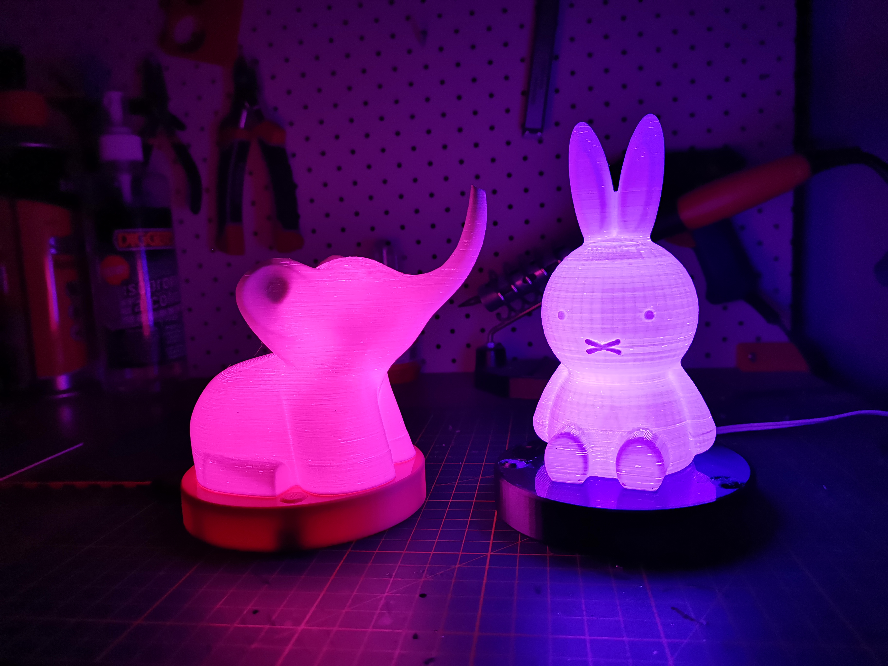

# LED Night Light
3d Printed Night Light using an Arduino Nano, two buttons and a short ws2812 LED strip

Checkout <INSERT YOUTUBE LINK HERE> for the full story

## Parts List
- 3d printed figurine (STLs not included)
- 3d Printed parts
- 1x 5v Micro-USB power supply (1A or more)
- 1x [Arduino Nano](https://core-electronics.com.au/arduino-nano-v3-2.html)
- 1x [Mt3608 DC 2A Step Up Power Booster Module](https://www.addicore.com/MT3608-Boost-Converter-p/ad300.htm)
- 2x 10kΩ Resistor
- 1x 220Ω Resistor
- 1x [KCD11-101 Rocker Switch](http://www.sqele.com/en/content/?780.html)
- 2x momentary switch buttons
- Red, white & black solid core jumper wire

